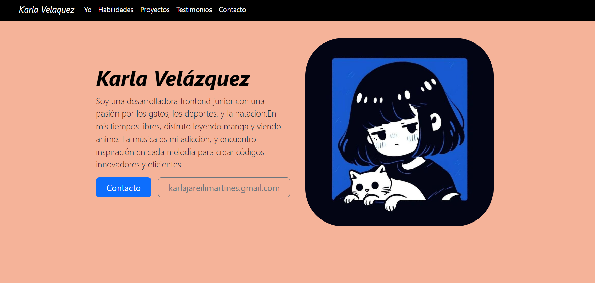
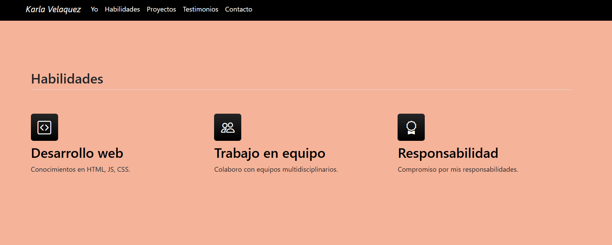
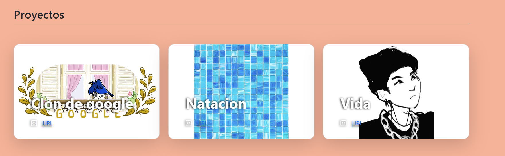
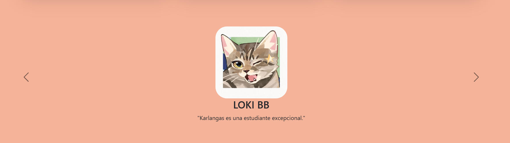
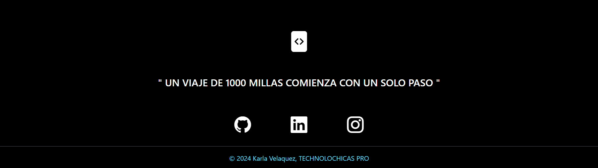

# Mi portafolio de habilidades TECNOLOCHICAS PRO

El presente proyecto es un portafolo desarrollado para poner en practica las habilidades obtenidas dentro del bootcamp
de desarollo fronted de Tecnolochicas PRO.

Fue desarrollado con HTML, CSS y JS con el uso de el framework de UI, Bootstrap utilizando además bibliotecas externas.

La pagina es responsiva (adaptable a diferentes tamaños de pantalla) e incluye la presentacion de la autora del proyecto.

[Proyecto desplegado (https://chic-brigadeiros-db8e19.netlify.app/)](https://karla-velazquez.netlify.app/#)

## Secciones de mi sitio

## Tecnologias 
* HTML
* CSS
* Bootstrap 
* Javascript

---
Desarrollado con  💜 por [Karla Velazquez](https://chic-brigadeiros-db8e19.netlify.app/) en [TECHNOLOCHICAS PRO](https://tecnolochicas.mx/)

